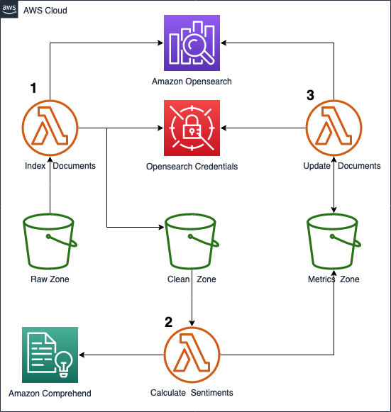

# Amazon OpenSearch batch indexing with AWS Lambda
This repository provides guidance on how to use the Amazon OpenSearch Python client to perform batch operations using Lambda functions and how to architect your solution using a data lake architecture. It includes the following files and folders:

- Code for the application's Lambda functions:
    - index_documents
    - update_documents
    - calculate_metrics
- environment.yaml - An environment file that can be used to re-create the virtual environment with the needed dependecies.
- template.yaml - A template that defines the AWS SAM application's AWS resources: AWS Lambda Functions and IAM Roles.
- cloudformation-template.yaml - A template to provision the rest of the architecture components: Amazon S3, Amazon OpenSearch and AWS Secrets Manager.

The application uses several AWS resources, including AWS Lambda functions. These resources are defined in the `template.yaml` and  `cloudformation-template.yaml` files in this project. You can update the template to add AWS resources through the same deployment process that updates your application code.

## Architecture Diagram




1. **Index Documents**: Indexes the file from the S3 Raw Zone into an OpenSearch index. Stores back the data with the ID of the document into the S3 Clean Zone.
2. **Calculate Metrics**: Does sentiment analysis on the data and stores the results in S3 Metrics Zone.
3. **Update Documents**: Updates the file in OpenSearch index with the sentiment analysis metric.


## Sample Scenario
AnyCompany periodically retrieves the comments from their blog site and indexes them into Amazon Opensearch. Their data scientists also perform sentiment analysis on the comments. Their data workflow is the following:

- The comments land in their data lake raw zone. A lambda function gets triggered and indexes the comments into Opensearch. It saves the document ID at indexing time and stores it in the clean zone.

- The data scientists team consumes the data and does sentiment analysis using Amazon Comprehend.

- The sentiment analysis metrics get stored in the S3 Metrics zone. A second lambda function gets then triggered and batch updates the document in Opensearch with the new metrics.


## Scenario Deployment

To the infrastructure of the scenario, we use CloudFormation and AWS SAM.

### Cloudformation Template

Deploy the Cloudformation template in eu-east-1 (N.Virginia)
- In the parameters section configure your Amazon Opensearch cluster domain name, master username and master password - Remember you credentials log in OpenSearch Dashboards.
- When deployed, in the Outputs section you will find Values that will be used later on.
- The SamBucket resource is used to deploy the AWS SAM Application.

Key  | Value
:-------------: | :-------------:
RawZoneBucket  | raw-zone-XXX
CleanZoneBucket  | clean-zone-XXX
MetricsZoneBucket  | metrics-zone-XXX
SamBucket        | sam-bucket-XXX 
DomainEndpoint  | search-XXX.us-east-1.es.amazonaws.com

### AWS SAM Application

The Serverless Application Model Command Line Interface (SAM CLI) is an extension of the AWS CLI that adds functionality for building and testing Lambda applications. 

To use the SAM CLI, you need the following tools:

* SAM CLI - [Install the SAM CLI](https://docs.aws.amazon.com/serverless-application-model/latest/developerguide/serverless-sam-cli-install.html)
* [Python 3 installed](https://www.python.org/downloads/)

To build and deploy your application for the first time, run the following in your shell:

```bash
# Configure your credentials
aws configure
# Create virtual environment with the needed packages
conda env create -f environment.yaml
# Activate the environment
conda activate opensearch-aws-samples
# Package and deploy your application to AWS
sam build
sam deploy --stack-name aws-sam-stack --s3-bucket sam-bucket-XXX --region us-east-1 --capabilities CAPABILITY_IAM
```

### Sample Data

For this scenario, we use the [Amazon Customer Reviews Dataset](https://s3.amazonaws.com/amazon-reviews-pds/readme.html): Over 130+ million customer reviews of Amazon products are available.

- We use a small data sample that can be downloaded from the `sample_data` folder of this repository.
- Upload it to the `RawZoneBucket` created from the Cloudformation template.

## Running the scenario

1. Log in OpenSearch Dashbaords URL with your credentials and open the Dev Tools console 
    - Console > Amazon OpeSsearch > cluster > domain > OpenSearch Dashbaords URL.
    - Create an OpenSearch index with the default configuration.
```bash
PUT comments-anycompany
```
2. Open the Index Documents Lambda aws-sam-stack-IndexDocuments-XXX` and run a test with the following payload (Substitute XXXX for your values):
```bash
{
  "source_bucket": "raw-zone-XXXX",
  "destination_bucket": "clean-zone-XXXX",
  "domain_endpoint": "search-XXXX.es.amazonaws.com",
  "key": "sample_us.json",
  "index": "comments-anycompany"
}
```

  -  In the OpenSearch Dashboards Dev Tool you can see the indexed documents:
```bash
GET comments_anycompany/_search
```

3. Open the Calculate Metrics Lambda aws-sam-stack-CalculateSentiment` and run a test with the following payload (Substitute XXXX for your values):
```bash
{
  "source_bucket": "clean-zone-XXXX",
  "destination_bucket": "metrics-zone-XXXX",
  "key": "sample_us.json"
}
```
4. Open the Update Documents Lambda aws-sam-stack-UpdateDocuments-XXX` and run a test with the following payload (Substitute XXXX for your values):
```bash
{
  "source_bucket": "metrics-zone-XXXX",
  "domain_endpoint": "search-mydomain-XXXX.us-east-1.es.amazonaws.com",
  "key": "metrics.json",
  "index": "comments-anycompany"
}
```
  -  In the OpenSearch Dashboards Dev Tool you can see the indexed documents with the new field `Sentiment`.
5. Explore the documents by doing some aggregations in the OpenSearch Dashboards Dev Tool:
```bash
# Example of query: How many comments of each Sentiment do we have?
GET comments_anycompany/_search
{
  "size": 0,
  "aggs": {
    "total_sentiments": {
      "terms": {
        "field": "Sentiment.keyword",
        "size": 10
      }
    }
  }
}
```

```bash
# Example of query: What is the Sentiment of the comments of ratings with less than 3 stars rating?
GET comments_anycompany/_search
{
  "size": 0,
  "aggs": {
    "high_rated": {
      "range": {
        "field": "star_rating",
        "ranges": [
          {
            "to": 3
          }
        ]
      },
      "aggs": {
        "total_sentiments": {
          "terms": {
            "field": "Sentiment.keyword",
            "size": 10
          }
        }
      }
    }
  }
}
```

## Cleanup

1. Delete the sample JSON files stored in the four S3 buckets.
2. Delete the two CloudFormation stacks though the console or CLI.
```bash
aws cloudformation delete-stack --stack-name YOUR_STACK_NAME
```
